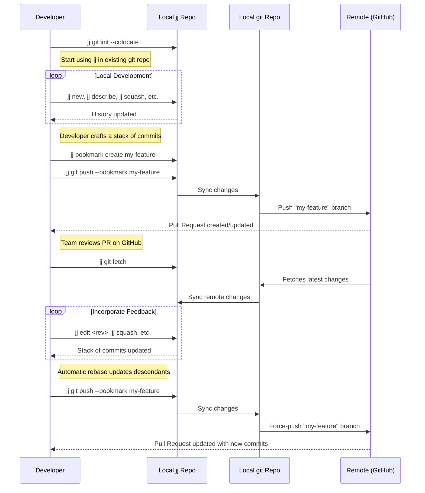

# Jujutsu (jj): A New Paradigm for Version Control

## Introduction: Reimagining Version Control Beyond Git

In the landscape of software development, Git has reigned as the undisputed standard for version control for over a decade. Its power and flexibility are undeniable, yet they come at the cost of a notoriously steep learning curve and a complex mental model that can frustrate even seasoned developers. Into this established ecosystem enters Jujutsu (jj), a modern version control system (VCS) that presents not merely an alternative Git client, but a fundamental rethinking of the developer's interaction with code history.\[^1\]\[^2\]

The central thesis of Jujutsu is the radical simplification of the version control paradigm. It achieves this by unifying disparate and often confusing Git concepts—the working copy, the staging area (or index), and the stash—into a single, cohesive entity: the commit.\[^3\]\[^4\] Every operation in Jujutsu, from a simple file edit to a complex history rewrite, operates on commits. This conceptual elegance streamlines workflows, reduces cognitive overhead, and eliminates entire classes of common Git errors.\[^5\]\[^4\]

This report frames its analysis around the core user benefit that emerges from this simplified model: a "fearless" development experience. Jujutsu is engineered for safety, providing a powerful net of features that encourages experimentation and minimizes risk. This safety net is woven from three key threads: a comprehensive operation log that makes any action reversible with a single `jj undo` command; a novel approach to "first-class" conflicts that allows operations to succeed without blocking the developer's workflow; and automatic, transparent history management that handles the tedious mechanics of rebasing descendant changes.\[^6\]\[^7\]\[^8\]

Crucially, Jujutsu's creators made the strategic decision to use Git's repository format as its primary storage backend. This design choice acts as a Trojan horse for adoption, allowing for risk-free, incremental integration into existing projects and teams. A developer can adopt Jujutsu locally, reaping its significant productivity benefits, while their colleagues continue to use standard Git tools, completely unaware of the change.\[^1\]\[^2\]\[^6\]\[^9\] This seamless interoperability is the critical bridge that makes Jujutsu a practical consideration for any developer or team in a Git-dominated world, rather than a theoretical curiosity. This report provides an exhaustive technical breakdown and analysis for the expert Git user, enabling an informed decision on whether Jujutsu represents the future of their workflow.

## Part I: The Jujutsu Paradigm

### Section 1: Genesis and Philosophy

To fully appreciate Jujutsu, one must understand its origins and the philosophical principles that guided its design. It is not a tool created in a vacuum but rather a deliberate response to the perceived shortcomings of existing systems, born from deep experience with version control at a massive scale.

#### The History of Jujutsu

Jujutsu began as a hobby project in late 2019, initiated by Martin von Zweigbergk, an engineer at Google.\[^7\]\[^10\] While it originated within Google and several Googlers contribute to its development, the project is explicitly not a Google product and is licensed under the permissive Apache 2.0 license.\[^7\]\[^10\] However, the project's trajectory and credibility have been significantly bolstered by the fact that von Zweigbergk now works on it full-time, with the stated goal for Jujutsu to eventually replace Google's current internal VCS client, "fig"—a heavily forked version of Mercurial (`hg`).\[^10\]\[^11\] This internal adoption plan signals strong institutional backing and a commitment to ensuring `jj` can handle the most demanding version control challenges, such as Google's famously large monorepo.\[^8\]

The name itself has a simple, pragmatic origin. The command-line binary, `jj`, was chosen for being short and easy to type. The full name "Jujutsu" was subsequently selected simply because it matched the "jj" abbreviation.\[^7\]

#### Core Inspirations: A Synthesis of the Greats

Jujutsu's design is a thoughtful synthesis, borrowing and refining concepts from the most influential version control systems of the last two decades.\[^7\]

- **From Git:** The most critical inspiration from Git is its data model and near-ubiquitous repository format. By using Git repositories as its default storage backend (via the `libgit2` library), `jj` ensures immediate and broad interoperability with the entire Git ecosystem, including forges like GitHub and GitLab.\[^7\]\[^10\] It also inherits Git's focus on performance, striving for a snappy user experience and efficient algorithms.\[^7\]

- **From Mercurial (hg) & Sapling:** The influence of Mercurial is profound, which is unsurprising given `jj`'s destiny as a replacement for Google's Mercurial-based tool. From `hg`, `jj` adopts the powerful `revset` query language for selecting revisions, a user-configurable templating language for formatting output, and, most significantly, the elimination of an explicit staging area in favor of a more direct interaction with commits.\[^7\]\[^9\] It also embraces the concept of "anonymous branches," where commits can exist without explicit names, a hallmark of the Mercurial workflow.\[^7\]

- **From Darcs:** Jujutsu incorporates the idea of treating merge conflicts as first-class objects within its data model. While not as formally rigorous as the "theory of patches" that underpins Darcs, this approach has a similar practical effect: it allows operations like rebases to complete even when conflicts arise, recording the conflict state for later resolution. This enables the automatic propagation of conflict resolutions through a chain of descendant commits, a feature that feels almost magical to those accustomed to Git's stop-the-world conflict model.\[^7\]

- **From Perforce (via Google's internal tooling):** Some users have noted that aspects of `jj`'s workflow feel reminiscent of centralized systems like Perforce.\[^5\] This is likely an echo of its heritage, as `jj` was heavily inspired by the internal tools at Google, which themselves were originally built upon Perforce. This lineage shows through in its robust handling of large-scale repositories and its focus on clean, linear history.

#### The Guiding Principles: Simplicity, Power, and Safety

The synthesis of these inspirations is guided by a clear set of design principles that prioritize the developer experience above all else.

- **Simplicity through Unification:** Jujutsu's primary philosophical goal is to reduce the number of concepts a developer must juggle. In Git, a developer must constantly track the state of their files across the working copy, the index (staging area), the stash, and the commit history. `jj` unifies these into a single concept: the commit.\[^3\]\[^4\] This is a direct response to the notorious complexity of Git commands like `git reset` and `git checkout`, whose behavior changes dramatically based on the arguments provided and the state of the index.\[^5\]\[^9\] By eliminating these distinct states, `jj` provides a more consistent and predictable interface.

- **Power through Orthogonality:** The system is designed with a smaller set of more general commands that can be combined in powerful ways. Because the working copy is just another commit, the same powerful history manipulation tools used on historical commits can be used on your current, uncommitted work.\[^4\] This orthogonality means `jj` achieves greater power with fewer commands, avoiding the need for a sprawling and often overlapping of tools like in Git. The deprecation of `jj checkout` and `jj merge` in favor of the more general `jj new` is a testament to this design principle.\[^5\]

- **Safety by Design:** Jujutsu is built to be a forgiving system where mistakes are not catastrophic. This is most evident in the **operation log**, which records every change to the repository and allows any action to be undone with `jj undo`.\[^6\] This safety-first approach extends to its handling of concurrent operations, making it safe to use with distributed file systems like Dropbox or `rsync` without risking repository corruption, a known hazard with Git.\[^7\]\[^9\]

The philosophical break from Git is profound. Git was conceived by Linus Torvalds as a "toolkit"—a versioned filesystem with a set of powerful, low-level primitives upon which a user-friendly VCS could theoretically be built.\[^11\] In practice, this "porcelain" layer grew organically and often inconsistently, exposing much of the underlying complexity to the user. Jujutsu, in contrast, is designed from the top down as an "application." It intentionally abstracts the storage backend and presents a curated, consistent, and simplified interface designed around common developer workflows.\[^7\] This architectural difference is the root of `jj`'s ability to provide a user experience that is simultaneously simpler and more powerful than Git's.

### Section 2: Foundational Concepts

Jujutsu's simplified user experience is built upon a small set of powerful and interlocking concepts. Understanding these foundations is key to moving beyond a simple command-for-command mapping from Git and truly grasping the `jj` paradigm.

#### Changes vs. Commits: The Mutable/Immutable Duality

The most fundamental concept to understand in Jujutsu is the distinction between a "change" and a "commit," a duality that enables its fluid history manipulation.\[^6\]\[^7\]

- A **Change ID** is a unique, stable, and randomly generated identifier that is specific to Jujutsu. It represents a single, logical unit of work, such as a feature or a bug fix. This ID remains constant throughout the evolution of that work, even as it is amended, described, or rebased.\[^6\] In the output of `jj log`, this is the first, often colorful, string of characters.

- A **Commit ID** is the familiar, content-addressed hash (like Git's SHA) that represents an immutable snapshot of the repository at a specific point in time. This ID changes every single time the content, metadata (like the commit message), or parentage of the change is modified.\[^6\]

This dual-identity system is the core mechanism behind `jj`'s powerful automatic rebasing. When a developer uses a command like `jj edit` to modify a historical change, a new commit with a new commit ID is created. However, the change ID remains the same. Jujutsu then uses this stable change ID to identify all descendant changes in the graph and automatically rebases them on top of the newly created commit ID, seamlessly rewriting history without complex manual intervention.\[^3\]

#### The Working Copy as a Commit: Life Without a Staging Area

Arguably the most significant and initially jarring departure from Git is Jujutsu's treatment of the working copy. In `jj`, the current state of all tracked files on your disk is _always_ represented as a real commit.\[^7\]\[^9\] This special commit is called the "working-copy commit" and is ubiquitously referred to by the `@` symbol in `jj` commands.

Whenever a developer modifies a file and then runs any `jj` command, the working-copy commit is automatically and implicitly amended to reflect those changes.\[^4\] This has several profound consequences:

1. **The Staging Area is Eliminated:** There is no `git add` or staging step. The concept of an index as an intermediate area between the working directory and a commit simply does not exist.\[^9\] This removes a major source of complexity and confusion for many Git users.

2. **`git stash` is Obsolete:** The need for `git stash` to save work-in-progress when switching contexts vanishes. In `jj`, to "stash" your work, you simply create a new change with `jj new`. Your previous work is safely stored in the now-parent commit, which you can return to at any time with `jj edit`.\[^3\]\[^6\] It's just another commit in the graph.

3. **Powerful Commit-Crafting Workflows:** Workflows that relied on the index in Git, such as interactively building up a commit from partial file changes (`git add -p`), are replaced by a more powerful and consistent set of commit-manipulation commands. Instead of _adding_ changes to an index, you _subtract_ them from the working-copy commit into a new one using `jj split`, or you _move_ them into a parent commit using `jj squash -i`.\[^9\]

#### The Operation Log (`oplog`) and Evolution Log (`evolog`): A Safety Net for History

Jujutsu provides two powerful logging mechanisms that offer an unparalleled safety net and audit trail.

- **The Operation Log (`oplog`):** This is `jj`'s super-powered replacement for Git's `reflog`. While `reflog` tracks the history of individual refs (like branches or HEAD), the `oplog` records every single operation that modifies the repository's state—commits, rebases, squashes, pushes, bookmark moves—as a single, atomic transaction.\[^7\]\[^9\] This transactional log is the engine behind `jj`'s famous `jj undo` command, which can reliably roll back the last operation, and `jj op restore <op-id>`, which can transport the repository back to any previous state with perfect fidelity.\[^6\]

- **The Evolution Log (`evolog`):** This log is unique to Jujutsu and is a direct consequence of the change/commit duality. The `evolog` tracks the history of a _single change ID_ over time.\[^6\] For example, if you create a change, then amend its description, then squash a fix into it, `jj evolog` will show you the sequence of immutable commit IDs that have represented that one logical change. This provides an incredible audit trail for a single piece of work and allows for the recovery of previous versions of a change that would be lost in Git's `reflog`.\[^6\]

#### First-Class Conflicts: Enabling Uninterrupted Workflows

Jujutsu's handling of merge conflicts is a radical departure from Git's and a cornerstone of its "fearless" workflow. In Git, a merge conflict is a stop-the-world event; the rebase or merge operation fails, and the repository is put into a special, locked state that must be resolved before any other work can proceed.

In `jj`, operations that result in conflicts are allowed to succeed.\[^1\]\[^7\] The conflict itself is recorded as part of the metadata of the resulting commit. The `jj log` output will clearly mark the commit as conflicted, and the affected files on disk will contain the standard `<<<<<<<`, `=======`, `>>>>>>>` markers.\[^9\] However, the repository remains in a normal, workable state. The developer can ignore the conflict, switch to another change, and continue working. The conflict can be resolved at any time using `jj resolve`.\[^6\] Once resolved (by editing the files and squashing the resolution into the conflicted commit), the fix is automatically propagated to any descendant commits that were also affected by the same conflict. This behavior is effectively a transparent, built-in version of Git's `rerere` (reuse recorded resolution) functionality, but integrated into the core design of the system.\[^7\]\[^3\]

#### Anonymous Branching and Bookmarks: A "Detached HEAD" Native Experience

Jujutsu's default mode of operation is what a Git user would call a "detached HEAD" state.\[^9\] A developer works on chains of commits, which are often called "anonymous branches," without needing to assign a name to them upfront. This encourages a more fluid and experimental workflow, as there is no overhead to starting a new line of inquiry.\[^3\] `jj` diligently tracks all commit heads (or "leaves" of the graph), so this work is never lost or garbage-collected, a common fear for Git users in detached HEAD mode.\[^9\]

When a persistent name is required—typically for collaboration or pushing to a remote like GitHub—Jujutsu uses **bookmarks**. Bookmarks are analogous to Git branches, but with one crucial difference: they do not move automatically when new commits are created.\[^9\] If you are "on" a commit that has a bookmark and you create a new change, the bookmark remains on the parent commit. It must be explicitly moved to the new commit using a command like `jj bookmark move`. This design choice makes the developer's intent explicit and prevents the kind of accidental history divergence that can happen in Git when one forgets which branch is active. Furthermore, bookmarks are identified by their name across different remotes, which simplifies the mental model for tracking remote branches.\[^9\]

## Part II: Jujutsu in Practice

### Section 3: Core Functionality and Commands

While Jujutsu's conceptual framework is elegant, its practical power is realized through a well-designed and consistent command-line interface (CLI). The following is an expert-level guide to the core `jj` commands, organized by common development workflows. This is not an exhaustive list but covers the fundamental tools needed for daily work.\[^6\]

#### Managing Changes: The Basic Loop

This set of commands forms the core of the `jj` development cycle: creating, describing, and viewing work.

- `jj new...`: This is the primary workhorse command for starting new work. In its simplest form, `jj new` creates a new, empty working-copy commit (`@`) on top of the previous one, effectively preparing a blank slate for a new task.\[^6\] Its power lies in its generality; it replaces several Git commands. `jj new main` is equivalent to `git switch -c new-branch main`. Furthermore, by accepting multiple revisions as arguments (e.g., `jj new feature-a feature-b`), it creates a merge commit, thus subsuming the functionality of `git merge`.\[^5\] This consolidation of commands is a prime example of `jj`'s design philosophy.

- `jj describe [-m "message"]`: This is the canonical way to add or edit a commit message.\[^9\] By default, it operates on the working-copy commit (`@`) and opens the configured text editor. The `-m` flag allows for providing a message directly on the command line. This workflow, where one describes the intended work _before_ writing the code, is a key philosophical shift from the typical Git `commit` flow and is encouraged as a way to promote more intentional development.\[^5\]

- `jj log [-r <revset>]`: The `jj` equivalent of `git log --graph`, this command displays the commit history. By default, its output is rich, colorful, and intelligently filtered to show only "interesting" commits, such as local heads and their immediate context, to avoid overwhelming the user with the entire remote history.\[^3\] Its true power is unlocked with the `-r` flag, which accepts a "revset" expression—a powerful query language for selecting revisions. For example, `jj log -r 'mine() & ~remote_bookmarks()'` shows all of your commits that have not yet been pushed to any remote.\[^4\]\[^9\]

- `jj commit`: This is a convenience command that can be thought of as a combination of `jj describe` and `jj new`.\[^6\] It takes a message, applies it to the current working-copy commit, and then creates a new empty working-copy commit on top. It can also be used with the `-i` (interactive) flag to select specific hunks from the working copy to be included, effectively splitting the working copy into two commits and providing a workflow analogous to `git add -p` followed by `git commit`.\[^9\]

#### Mastering History Rewriting: The `jj` Superpower

This is the family of commands that gives developers the feeling of being "time travelers" and represents `jj`'s most significant advantage over Git for workflows that value clean, atomic commit histories.\[^8\]

- `jj edit <REV>`: This command moves the working-copy commit (`@`) to any arbitrary commit in the history, allowing you to directly modify its files. Once you are done, you can use `jj edit` again to jump back to your original position. Any changes made to the historical commit are preserved, and all of its descendants are automatically and transparently rebased on top of the modified version.\[^3\]

- `jj rebase -s <source> -d <destination>`: This is the core command for reordering history. It moves a source revision (or an entire branch of revisions) to a new parent at the destination. Its most crucial feature is that it _always succeeds_, even in the face of merge conflicts. The conflict is simply recorded in the rebased commit for later resolution, preventing workflow interruptions.\[^8\]

- `jj squash [-i]`: This command moves changes from a source commit (by default, `@`) into its immediate parent.\[^6\] It is the primary tool for amending commits. When used on the working-copy commit, it is analogous to `git commit --amend`. The interactive mode (`-i`) opens a diff editor, allowing you to select specific lines or hunks to move into the parent, providing a powerful and intuitive way to craft and refine commits.\[^4\]

- `jj split [-i]`: The logical inverse of `squash`, this command splits a single commit into two. It is invaluable for untangling changes that were accidentally committed together.\[^9\] The interactive mode allows for precise selection of which changes move to the first commit and which remain in the newly created second commit.

- `jj move`: A more generalized version of `squash`, this command allows you to move changes from one arbitrary commit directly into another, without them needing to be parent and child.\[^9\]

- `jj abandon <REV>`: This command effectively deletes a revision from history. It achieves this by rebasing all of the revision's children directly onto its parents, then hiding the abandoned revision from view.\[^6\]

#### Inspecting the Repository

These commands are for understanding the current state of the repository and its files.

- `jj status` or `jj st`: Provides a high-level summary of the repository. It shows the current working-copy commit, its parent(s), a summary of file changes in the working copy, and any existing conflicts.\[^6\]

- `jj diff`: Shows the changes in the working copy (`jj diff`) or the changes between any two arbitrary revisions (`jj diff -r <rev1>..<rev2>`). It supports various output formats, including a traditional Git-style patch (`--git`) and a colorized word-level diff (`--color-words`).\[^6\]

- `jj show <REV>`: Displays the full commit message and the patch (diff) for a given revision.\[^6\]

#### Recovery and Auditing: The Safety Net in Action

This suite of commands showcases `jj`'s commitment to safety and reversibility.

- `jj op log`: Displays the operation log, a chronological list of every action that has modified the repository state. Each entry has a unique operation ID.\[^6\]

- `jj undo` or `jj op undo`: Reverts the most recent operation recorded in the `oplog`. This is the ultimate safety feature, allowing developers to fearlessly experiment with complex rebases or other history rewrites, knowing they can always return to the previous state with a single command.\[^4\]\[^6\]

- `jj op restore <OP_ID>`: A more powerful version of `undo`, this command restores the entire repository to the exact state it was in immediately after a specific operation ID from the `oplog` was completed. It is a true time machine for your repository's state.\[^6\]

- `jj evolog [-p]`: Displays the evolution log for a given change ID, showing all the immutable commit IDs that have represented that change over time. Using the `-p` (`--patch`) flag shows the diff between each successive evolution, providing a clear audit trail of how a change was crafted and modified.\[^6\]

### Section 4: Seamless Git Interoperability

Jujutsu's most strategic feature is its deep and thoughtful integration with Git. This compatibility allows it to function not as a disruptive replacement, but as a powerful, progressive enhancement to existing Git-based workflows. For most users, `jj` acts as a superior local interface to a standard Git repository, with all collaboration happening through familiar Git forges like GitHub.\[^2\]\[^3\]

#### The Co-location Model: `jj git init --colocate`

The primary method for using Jujutsu with an existing Git project is through co-location. Running the command `jj git init --colocate` within a Git repository creates a `.jj` directory alongside the existing `.git` directory.\[^9\] This setup allows both the `jj` and `git` command-line tools to operate on the same working copy.

The underlying mechanism involves `jj` automatically synchronizing its view of the repository (its branches, heads, etc.) with the Git repository's refs and objects whenever a `jj` command is run. A key aspect of this synchronization is that the underlying Git repository is kept in what Git users would call a "detached HEAD" state.\[^9\] This is the native mode for `jj`, which does not rely on the concept of a "current branch," but it can be surprising to Git-native tools or IDEs that expect an active branch to be checked out.

The benefits of this model are immense. It allows a developer to use `jj` for its powerful command-line capabilities (like history rewriting and conflict resolution) while still relying on the rich ecosystem of Git-based tooling, such as the mature VCS integrations found in IDEs like VS Code or JetBrains, for tasks like viewing diffs or resolving conflicts visually.\[^9\] This hybrid approach provides the best of both worlds and dramatically lowers the barrier to adoption.

However, the co-location model is not without its drawbacks. Care must be taken when interleaving mutating `git` commands (like `git commit` or `git rebase`) with `jj` commands, as this can lead to confusing bookmark conflicts or divergent changes that `jj` will then need to resolve.\[^9\] Additionally, in very large repositories, the overhead of constantly importing and exporting changes between the `jj` and Git data stores can introduce a noticeable performance penalty for some commands.\[^9\] For most users who primarily use `jj` for modifications, these drawbacks are minor.

#### Working with Remotes: A Guide to `jj git push` and `jj git fetch`

Interacting with remote Git repositories is handled by a dedicated set of `jj git` subcommands.

- `jj git fetch`: This command fetches updates from a configured remote repository. Unlike `git pull`, it does not automatically merge or rebase the fetched changes into the local work. It simply updates the remote-tracking bookmarks (e.g., `main@origin`).\[^9\] The developer must then explicitly rebase their local work on top of the fetched changes using a command like `jj rebase -d main@origin`. This explicit, two-step process gives the developer more control but is also a noted workflow gap, as there is currently no single command equivalent to `git pull`.\[^9\]

- `jj git push`: This command is used to publish local changes to a remote. It requires specifying what to push, typically via a bookmark (`--bookmark my-feature`) or a specific change (`--change <rev>`).\[^9\] Pushing a bookmark to a remote has the effect of creating or updating a Git branch of the same name on that remote.

A critical design choice that new users must understand is that `jj git push` behaves like `git push --force-with-lease` by default.\[^8\] Because Jujutsu workflows encourage constant history rewriting (amending, squashing, rebasing), most pushes to a feature branch will be non-fast-forward. To support this workflow without excessive friction, `jj` will automatically force-push to update the remote branch. This is done safely; it will refuse to overwrite any changes on the remote that have not yet been fetched locally, thus preventing the accidental deletion of a collaborator's work.\[^8\] This implicit force-pushing is essential to the `jj` experience but can be startling for developers deeply conditioned by Git's warnings against rewriting public history.

#### Collaborative Workflows: Being the "Lone `jj` User" on a Git-Native Team

Synthesizing these concepts, a clear and effective strategy emerges for a single developer to adopt Jujutsu on a team that otherwise uses Git exclusively. This "lone `jj` user" workflow is not only feasible but is a primary use case for the tool.\[^2\]\[^6\]

The workflow is as follows:

1. **Initialize:** In the team's Git repository, run `jj git init --colocate`.

2. **Local Development:** Use `jj` for all local work. Create new changes with `jj new`, craft atomic commits using `jj squash` and `jj split`, and reorder history with `jj rebase`. Enjoy the full power and safety of the `jj` environment.

3. **Prepare for Sharing:** When a stack of changes is ready for a pull request, create a named bookmark that points to the head of the stack: `jj bookmark create my-awesome-feature`.

4. **Push to Remote:** Push the bookmark to the remote repository: `jj git push --bookmark my-awesome-feature`. This action creates a regular Git branch named `my-awesome-feature` on GitHub/GitLab, which the rest of the team can see and review as they normally would.

5. **Incorporate Feedback:** As review comments come in, fetch any new changes from the main branch (`jj git fetch`). Use `jj edit`, `jj squash`, and other commands to amend the local commits. The automatic rebasing feature will seamlessly update the entire stack of changes.

6. **Update the Pull Request:** Once the changes are addressed, simply push the bookmark again: `jj git push --bookmark my-awesome-feature`. `jj` will safely force-push the updated branch, and the pull request will be updated accordingly.

This workflow is completely transparent to collaborators. They see only standard Git branches and commits, while the `jj` user benefits from a vastly superior local development experience. The following diagram illustrates this common workflow.

## Part III: Comparative Analysis and Ecosystem

### Section 5: A Fair Comparison: Jujutsu vs. Git

A direct, feature-by-feature comparison between Jujutsu and Git can be misleading because the true difference lies in their underlying philosophies and the resulting developer workflows. This section provides a multi-faceted analysis, comparing their mental models, common workflows, CLI design, and performance characteristics.

#### Mental Model Shift: From Staging and Stashing to a Unified Commit Graph

The most profound difference between the two systems is the mental model they impose on the user.

- **Git's Multi-State Model:** Git forces the developer to constantly reason about at least three distinct states for their code: the **working directory** (untracked changes), the **index** or **staging area** (changes selected for the next commit), and the **commit history** (immutable snapshots).\[^3\]\[^9\] A fourth state, the **stash**, exists for temporarily saving work. This multi-state model is the source of much of Git's complexity. It necessitates commands like `git reset`, which has `--soft`, `--mixed`, and `--hard` flags specifically to manage the transitions between these different states.\[^3\]\[^9\]

- **Jujutsu's Unified Model:** Jujutsu radically simplifies this by collapsing these states into a single concept: the **commit graph**.\[^4\] The working copy is a commit (`@`), the stash is replaced by simply creating a new commit, and the index is eliminated entirely. This means `jj` has fewer "nouns" or core concepts to learn.\[^4\] Consequently, its command set is more consistent and orthogonal; there is no need for flags like `--soft` or `--hard` because all operations are simply commit-to-commit transformations.\[^3\] This shift reduces cognitive load and makes the entire system more predictable.

#### Workflow Showdown: A Practical Comparison of Common Scenarios

The impact of this mental model shift is best illustrated through common development scenarios. The following table provides a translation layer for a Git power user, mapping their familiar workflows to the Jujutsu paradigm.

**Table 1: Jujutsu vs. Git: Command and Workflow Equivalency**

| Goal / Git Workflow                                                       | Jujutsu (jj) Equivalent               | Conceptual Difference                                                                                                                                                                                                      |
| ------------------------------------------------------------------------- | ------------------------------------- | -------------------------------------------------------------------------------------------------------------------------------------------------------------------------------------------------------------------------- |
| **Start New Work** (`git switch -c new-branch`)                           | `jj new` or `jj new <parent-rev>`     | `jj` creates a new, empty working-copy commit. Branches (bookmarks) are optional and are not created or switched automatically.                                                                                            |
| **Stage Partial Changes** (`git add -p`)                                  | `jj split -i` or `jj squash -i`       | Instead of _adding_ changes to an index, `jj` _splits_ changes out of the working-copy commit or _squashes_ them into its parent. The operation acts on commits, not a separate staging area.\[^9\]                        |
| **Amend Last Commit** (`git commit --amend`)                              | `jj describe -m "..."` or `jj squash` | `jj describe` just updates the message. `jj squash` moves the current work (`@`) into its parent. Both achieve the amend effect. The working copy is always being "amended" automatically.\[^4\]                           |
| **Fix an Old Commit** (`git rebase -i`, change `pick` to `edit`)          | `jj edit <rev>`                       | `jj` makes this a trivial, first-class operation. `jj edit` jumps to the old commit, and all descendants are automatically rebased after the fix is made.\[^3\]                                                            |
| **Stash Changes** (`git stash`)                                           | `jj new`                              | Stashing is unnecessary. Simply create a new commit with `jj new`. The previous work-in-progress is safely stored in the parent commit, which is just another commit in the log.\[^3\]\[^6\]                               |
| **Undo a Commit** (`git revert <hash>`)                                   | `jj abandon <rev>`                    | `jj abandon` removes the commit from the visible history and rebases its children onto its parents. `jj revert` is also available for creating an actual revert commit.                                                    |
| **Undo an Operation** (`git reflog`, `git reset`)                         | `jj undo` or `jj op restore <op-id>`  | `jj`'s operation log is transactional. `jj undo` reliably reverts the _entire last operation_, making it much safer and more powerful than trying to manually undo things with `reflog` and `reset`.\[^6\]                 |
| **View History** (`git log --graph`)                                      | `jj log`                              | `jj log` provides a rich, graphical view by default, intelligently filtering the log to show relevant local heads and context, avoiding the noise of the full remote history.\[^5\]                                        |
| **Resolve Merge Conflicts** (resolve, `git add`, `git rebase --continue`) | `jj resolve` then `jj squash`         | In `jj`, the rebase or merge _succeeds_ and creates a conflicted commit. The conflict can be resolved at any time, and the resolution is squashed into the conflicted commit. The workflow is not interrupted.\[^1\]\[^3\] |

#### CLI Design and Usability: A Study in Consistency and Simplicity

The user experience of the command-line interface itself is a significant point of differentiation.

- **Consistency and Conciseness:** `jj`'s CLI is frequently lauded for its consistency and thoughtful design.\[^3\]\[^4\] There is a clear effort to reduce the number of commands and flags. The prime example is `jj new` subsuming the roles of `git checkout`, `git switch`, and `git merge`, providing a single, more general command for creating new commits, whether they have one parent or many.\[^5\]

- **Informative by Default:** In contrast to Git's often spartan output, `jj` commands like `jj log` and `jj st` provide rich, color-coded, and highly informative summaries by default. The log uses unicode characters to build a clear graph, and highlights the shortest unique prefixes for change and commit IDs, which can be used for quick reference.\[^5\]

- **Powerful Customization:** Jujutsu features a powerful templating language and a straightforward aliasing system, allowing users to customize the output of nearly any command to fit their exact needs. The CLI completion, especially on shells that support dynamic completions like Fish, is also noted as being excellent.\[^11\]

#### Performance Considerations: Analyzing Speed and Scalability

Performance is a nuanced topic, with both systems having distinct strengths and weaknesses.

- **Where Jujutsu Excels:** `jj`'s performance shines in in-memory operations, particularly history rewriting. Because commands like `jj rebase` are designed to operate on the commit graph with minimal filesystem interaction, they are dramatically faster than their Git counterparts.\[^10\]\[^11\] This performance advantage was so significant that it directly inspired the proposal for the `git replay` command, an effort to re-architect Git's own rebase mechanism for better speed.\[^10\]

- **Where Jujutsu Faces Challenges:** The primary performance bottleneck for `jj` occurs in operations that need to interact with the working copy, especially in very large repositories. Because the working copy is a commit, commands like `jj status` must "snapshot" the state of the filesystem to generate the commit, which can be slow.\[^9\] This is exacerbated in the co-located model, where the additional overhead of synchronizing with the Git ref store can slow down commands even further.\[^9\] A `jj push` can also be CPU-bound and significantly slower than a `git push` in some scenarios.\[^9\]

- **Mitigations and Future Direction:** The `jj` team is actively working on these issues. Performance in large working copies can be substantially improved by integrating with filesystem monitoring tools like `watchman`, which `jj` supports.\[^3\]\[^9\] The project's official roadmap includes ambitious plans to tackle scalability head-on with features like a Virtual File System (VFS) to make working copy updates nearly instantaneous, and native cloud-based backends designed explicitly for monorepo scale.\[^12\]

### Section 6: Adoption and Community Landscape

While still a young project, Jujutsu is gaining traction among specific developer communities. Its adoption pattern and the sentiment within these communities provide valuable insight into its strengths, weaknesses, and potential trajectory.

#### Current Adoption: Who is Using `jj`?

Formal, large-scale enterprise case studies of `jj` adoption are not yet available. However, the existing evidence points to a clear and growing user base across several key profiles.

- **Google:** The most significant and strategic adopter is Google itself. Jujutsu is being actively developed with the intention of it becoming the standard version control client for Google's internal monorepo, one of the largest and most complex codebases in the world.\[^10\]\[^11\] This internal adoption serves as the ultimate stress test for `jj`'s scalability and performance, and the fact that it is von Zweigbergk's full-time job lends the project immense credibility and a strong promise of long-term support.

- **Individual Power Users and Early Adopters:** The most vocal proponents of `jj` are individual developers who are often already Git power users. These are typically engineers who feel the friction of Git's more complex workflows, such as maintaining a clean, atomic commit history for review or managing stacked pull requests.\[^5\]\[^8\] Testimonials from developers at companies like Personio \[^3\] and independent consultants \[^4\] demonstrate its use in real-world commercial projects, even if it's on an individual-by-individual basis.

- **The Jujutsu Team (Dogfooding):** In a classic example of "eating your own dog food," the core contributors to Jujutsu use `jj` for its own development on GitHub.\[^7\]\[^10\] This ensures that the developers are intimately familiar with the user experience and are constantly driven to improve the tool they rely on daily.

#### Community Perspectives: Synthesizing Insights from Hacker News and Reddit

A review of discussions on technical forums like Hacker News and Reddit reveals a vibrant and largely positive reception, alongside healthy skepticism. This qualitative data provides a clear picture of how `jj` is perceived by its target audience.

- **Overwhelmingly Positive Themes:**

  - **Relief from Git's Complexity:** A recurring theme is the feeling of relief and newfound productivity. Users frequently describe how, after an initial adjustment period, Git starts to feel "clunky," "wrong," or unnecessarily complicated in comparison.\[^5\]\[^11\] The simplified mental model is a major draw.

  - **The Power and Safety of History Manipulation:** The ease and, crucially, the safety of commands like `jj rebase`, `jj edit`, and `jj squash` are consistently cited as "killer features".\[^5\]\[^8\] The ability to fearlessly restructure a stack of commits without a complex `git rebase -i` session is a game-changer for many.

  - **The "Aha!" Moment:** Many testimonials describe a similar adoption journey: initial skepticism, a period of feeling slower while learning the new workflow, and then a sudden "aha!" moment when the `jj` mental model clicks. After this point, users report that they cannot imagine going back to the old Git workflow.\[^11\]

- **Common Points of Skepticism and Debate:**

  - **The Lack of a Staging Area:** For Git experts who have mastered `git add -p` to craft their commits, the absence of an index is the most common point of initial resistance. The debate often centers on whether the `jj split` and `jj squash -i` workflows are a true and ergonomic replacement for the familiar staging process.\[^5\]\[^11\]

  - **Automatic File Tracking:** The default behavior of automatically including any new, non-ignored file in the working-copy commit raises concerns for some, who fear accidentally committing temporary files, build artifacts, or secrets.\[^3\]\[^4\] Proponents argue that this encourages better `.gitignore` discipline and is a non-issue in practice.\[^3\] This behavior is also configurable.

  - **"Is it Really Better, or Just Different?":** A segment of users remains unconvinced that `jj` offers a fundamental improvement, arguing that most of its workflows can be replicated in Git with a combination of aliases, custom scripts, and a deep understanding of its commands. They question whether learning a new tool is worth the effort when their existing, highly-customized Git setup already works for them.\[^5\]\[^11\]

The discourse around Jujutsu reveals a fascinating dynamic. Its benefits are not derived from a single, easily marketable feature, but from a holistic improvement to the entire development workflow. This makes its advantages subtle and difficult to articulate in a short pitch, creating an "evangelism gap." Experienced `jj` users often struggle to convey the "feeling" of a smoother, safer workflow to skeptical Git users, who may see the individual features as mere alternatives to existing Git commands.\[^5\]\[^11\] The value is emergent, arising from the combination of its simplified model, powerful commands, and safety features. This report aims to bridge that gap by not just listing features, but by meticulously explaining how they interconnect to create a superior development _experience_.

### Section 7: The Growing Ecosystem: Third-Party Tooling

A version control system's success is deeply intertwined with the quality and breadth of its surrounding ecosystem. For many developers, strong integration with their preferred editor or IDE is non-negotiable. While the Jujutsu ecosystem is still young and maturing, a vibrant community has already produced a variety of tools to enhance the `jj` experience.\[^13\]

#### Graphical and Terminal User Interfaces (GUIs & TUIs)

For users who prefer a more visual interaction with their repositories, several graphical and terminal-based interfaces are available.

- **Graphical User Interfaces (GUIs):** The most prominent native GUI is `GG - GUI for JJ`, a cross-platform application designed to simplify graph manipulation workflows.\[^13\]

- **Terminal User Interfaces (TUIs):** There is significant activity in the TUI space, indicating strong community interest in building "lazygit-like" experiences for `jj`. Notable projects include:

  - `Jujutsu UI (jjui)`: Often cited in community discussions as a fast, stable, and intuitive TUI. It appears to be a favorite among current users.\[^11\]\[^13\]

  - `LazyJJ`: A TUI explicitly inspired by the popular `lazygit` tool for Git.\[^13\]

  - `JJ TUI`: A TUI built with the OCaml programming language.\[^13\]

  - `Visual Jujutsu (vjj)`: An interactive terminal wrapper that leverages the fuzzy finder `fzf` to navigate and operate on the commit graph.\[^13\]

#### Editor and IDE Integration: A Deep Dive into VS Code Extensions

Editor integration is a critical factor for adoption. The landscape is rapidly evolving, with a particular focus on Visual Studio Code.

- **Visual Studio Code:** VS Code users have two primary extensions to choose from, representing a classic open-source versus proprietary trade-off.

  - **Jujutsu Kaizen (`jjk.jjk`):** This is a free, open-source extension developed by the community with the goal of reaching feature parity with VS Code's excellent built-in Git extension.\[^13\]\[^14\] It currently supports essential features like file status tracking in the gutter and source control panel, viewing diffs, line-by-line blame, creating and describing changes, and even undoing operations. It has a healthy install base of over 1,500 users.\[^14\]

  - **VisualJJ (`visualjj.visualjj`):** This is a competing extension that, while free to install, is proprietary (not open-source) and includes telemetry and data collection.\[^13\]\[^15\] It boasts a polished interface with advanced features like drag-and-drop rebasing in its commit tree view and seamless GitHub PR integration. It has a slightly larger install base of over 2,000 users.\[^15\] The choice between the two will likely come down to a user's preference for open-source software versus polished, proprietary features.

- **JetBrains IDEs (IntelliJ, WebStorm, etc.):** Native `jj` support in JetBrains products is one of the most highly requested features in the community.\[^5\] Currently, no dedicated plugin exists. However, users have reported that when using the co-located Git backend, some of the IDE's built-in Git integration continues to function, particularly for viewing diffs and resolving conflicts.\[^5\] Many users configure `jj` to use their JetBrains IDE as the external diff and merge tool. An official feature request is tracked under the issue `IJPL-174543`.\[^5\]

- **Neovim:** The Neovim community is another area with high demand for a dedicated `jj` plugin. While users report that existing Git plugins like `fugitive.vim` can be made to work, the experience has "painful edges" due to the conceptual differences between `jj` and Git.\[^5\] A dedicated diff-editor, `Hunk.nvim`, has been created specifically for `jj`, but a comprehensive, full-featured plugin remains a key gap in the ecosystem.\[^13\]

#### Other Integrations

Beyond full-fledged UIs, a number of smaller, focused tools exist to aid specific workflows.

- `Diffedit3`: A web-based, three-way diff editor that can be configured as `jj`'s external diff tool, serving as an alternative to desktop applications like Meld.\[^13\]

- `jj-fzf`: A powerful command-line wrapper that uses the fuzzy finder `fzf` to provide an interactive interface for browsing logs, previewing diffs, and executing common `jj` operations with keyboard shortcuts.\[^13\]

The following table provides an at-a-glance summary of the major third-party tools in the Jujutsu ecosystem.

**Table 2: Jujutsu Ecosystem: Third-Party Tools Overview**

| Tool Name             | Category          | Link                                                                       | Description / Key Features                                                                                                                    |
| --------------------- | ----------------- | -------------------------------------------------------------------------- | --------------------------------------------------------------------------------------------------------------------------------------------- |
| **GG - GUI for JJ**   | GUI               | [GitHub](https://github.com/gulbanana/gg)                                  | Cross-platform graphical user interface for `jj`, focused on making graph manipulation easy.\[^13\]                                           |
| **Jujutsu UI (jjui)** | TUI               | [GitHub](https://github.com/idursun/jjui)                                  | A fast and stable Terminal User Interface. A community favorite for its intuitive keybindings and performance.\[^11\]\[^13\]                  |
| **LazyJJ**            | TUI               | [GitHub](https://github.com/Cretezy/lazyjj)                                | A `lazygit`-inspired Terminal User Interface for `jj`.\[^13\]                                                                                 |
| **Jujutsu Kaizen**    | VS Code Extension | [Marketplace](https://marketplace.visualstudio.com/items?itemName=jjk.jjk) | Open-source extension aiming for parity with the built-in Git SCM provider. Supports file status, diffs, blame, and change management.\[^14\] |
| **VisualJJ**          | VS Code Extension | [Website](https://www.visualjj.com/)                                       | Proprietary extension with advanced features like drag-and-drop rebase and integrated GitHub PR management.\[^15\]                            |
| **Hunk.nvim**         | Neovim Plugin     | [GitHub](https://github.com/julienvincent/hunk.nvim)                       | A diff-editor for Neovim that can be used as `jj`'s interactive diff tool.\[^13\]                                                             |
| **jj-fzf**            | CLI Tool          | [GitHub](https://github.com/tim-janik/jj-fzf)                              | A fuzzy-finder wrapper for `jj` that provides an interactive CLI experience for logging, diffing, and common operations.\[^13\]               |
| **Diffedit3**         | Web Tool          | [GitHub](https://github.com/ilyagr/diffedit3)                              | A web-based diff editor that can be used as an external tool for `jj diffedit` and `jj resolve`.\[^13\]                                       |

## Part IV: Future Outlook and Recommendations

### Section 8: The Road Ahead: Development and Limitations

Jujutsu is an ambitious project with a clear vision for the future. While it is already a powerful tool for many, it is still officially considered experimental, and its development roadmap and current limitations are important factors for any potential adopter to consider.\[^7\]

#### The Official Development Roadmap

The project's public roadmap outlines several key areas of focus that signal its long-term ambitions, moving it from a Git-compatible client to a full-fledged, standalone VCS platform.\[^12\]

- **Native Backend and Forge Integration:** A top priority is the maturation of `jj`'s own native storage backend, which is currently used for testing. The long-term vision includes an open-source, cloud-based backend inspired by Google's internal architecture, which would store commits and operation logs in a central database.\[^10\]\[^12\] This would be coupled with direct forge integrations, enabling commands like `jj github submit` or `jj gitlab submit` to manage pull/merge requests directly from the CLI, further streamlining the contribution workflow.\[^12\]

- **Performance at Scale:** The roadmap shows a clear focus on addressing performance bottlenecks for very large monorepos. Key initiatives include a **Virtual File System (VFS)**, which would allow for near-instantaneous checkouts by only materializing files on demand, and **better support for large files**, potentially using techniques like content-defined chunking (CDC) similar to systems like XetHub.\[^12\]

- **Ecosystem Enablement:** Recognizing that a rich tooling ecosystem is vital, the team plans to build a stable, language-agnostic **RPC API**. This would allow third-party tools (like IDEs not written in Rust) to interact with `jj` reliably, without needing to be recompiled against specific backend implementations. This API is a strategic move to accelerate the development of the mature GUIs and IDE integrations that users are demanding.\[^12\]

- **Closing Feature Gaps:** The team is aware of missing features from Git and plans to add support for key functionalities like **Git submodules** and **commit signing** to make `jj` viable for a wider range of projects.\[^10\]\[^12\]

#### An Honest Assessment of Current Limitations and Criticisms

Despite its strengths, prospective users must be aware of `jj`'s current limitations.

- **Missing Git Features:** The lack of support for certain widely-used Git features can be a dealbreaker. The most notable omissions are **`git-lfs`** (Large File Storage) and **Git submodules**.\[^10\] While submodule support is on the roadmap, `jj` is currently considered unusable in a repo that relies on LFS. Support for Git hooks is also limited due to `jj`'s architecture of operating on storage first, which makes it challenging to integrate with hooks that expect to operate on the filesystem.\[^10\]

- **Ecosystem Immaturity:** As detailed in the previous section, the tooling ecosystem is still in its infancy compared to Git's. The lack of polished, first-party-level IDE plugins for major platforms like JetBrains and Neovim is a significant hurdle for many developers who are not exclusively CLI-driven.\[^5\]\[^11\]

- **Performance Edge Cases:** While fast for many operations, the known performance issues with commands like `jj status` in large, co-located repositories are a practical concern that users must evaluate for their specific environment.\[^9\]

- **The "Jujutsu Kaisen" Problem:** A peculiar but real-world challenge is the name collision with the massively popular Japanese anime and manga series, _Jujutsu Kaisen_. This frequently pollutes search engine results, making it difficult for new users to find documentation and community discussions related to the version control system.\[^5\]\[^11\]

- **Workflow Gaps and Breaking Changes:** As a pre-1.0 project, `jj` is still evolving. Users should expect occasional breaking changes between releases.\[^2\] There are also minor but frequently mentioned workflow inconveniences, such as the lack of a single command equivalent to `git pull`.\[^9\]

### Conclusion: Is Jujutsu the Future of Your Workflow?

Jujutsu presents a compelling and coherent vision for the future of version control—one that prioritizes developer experience, safety, and simplicity without sacrificing power. By unifying the disparate concepts of the working copy, staging area, and stash into a single, elegant commit-based model, it dramatically reduces cognitive overhead. Its "fearless" workflow, enabled by a transactional operation log, first-class conflict handling, and automatic rebasing, empowers developers to experiment and refactor with a confidence that is often elusive in Git. Its strategic compatibility with the Git backend makes it not a risky proposition, but a progressive enhancement that can be adopted incrementally and without disruption.

However, `jj` is not yet a universal replacement for Git. Its ecosystem is still maturing, and its lack of support for critical features like `git-lfs` and submodules makes it a non-starter for many existing projects. The ideal candidate for adopting Jujutsu _today_ is a developer who fits a specific profile:

1. **A Git power user** who frequently engages in complex history manipulation—such as interactive rebasing, commit squashing, and managing stacked pull requests—and feels the friction and risk inherent in Git's tools.

2. **A developer comfortable with the command line**, as the GUI and IDE tooling, while promising, has not yet reached the maturity of the Git ecosystem.

3. **An individual or team working on projects that do not depend on currently unsupported Git features** like LFS or submodules.

4. **A professional willing to invest a few hours to learn a new mental model** in exchange for what is likely to be a significant long-term boost in productivity, safety, and overall development satisfaction.

For those who fit this profile, the transition to Jujutsu is likely to be transformative. Looking forward, if the Jujutsu team successfully delivers on its ambitious roadmap—complete with a native, scalable backend, seamless forge integrations, and a rich tooling ecosystem enabled by its planned RPC API—it has a credible chance to evolve from a niche power-user tool into a mainstream alternative to Git. Jujutsu is more than just a new set of commands; it is a glimpse into a more humane, more powerful, and ultimately more productive future for version control.

## Part V: Attribution and Sources

This document was generated using deep research and analysis by Google's Gemini Pro.

### References

\[^1\]:
Jujutsu Official Website. (<https://jj-vcs.github.io/>)

\[^2\]:
Jujutsu Official GitHub Repository. (<https://github.com/martinvonz/jj>)

\[^3\]:
Moritz, B. (2023). "Evaluating Jujutsu, a new Git-compatible VCS". ([https://www.moritz.systems/blog/evaluating-jujutsu/](https://www.google.com/search?q=https://www.moritz.systems/blog/evaluating-jujutsu/))

\[^4\]:
Mergify. (2023). "First impressions of Jujutsu, the Git-compatible VCS". ([https://blog.mergify.com/first-impressions-of-jujutsu-the-git-compatible-vcs/](https://www.google.com/search?q=https://blog.mergify.com/first-impressions-of-jujutsu-the-git-compatible-vcs/))

\[^5\]:
Hacker News Discussion: "Jujutsu, a Git-compatible VCS". ([https://news.ycombinator.com/item?id=33596155](https://www.google.com/search?q=https://news.ycombinator.com/item%3Fid%3D33596155))

\[^6\]:
Jujutsu Official Tutorial. ([https://github.com/martinvonz/jj/blob/main/docs/tutorial.md](https://www.google.com/search?q=https://github.com/martinvonz/jj/blob/main/docs/tutorial.md))

\[^7\]:
Jujutsu Design Document. ([https://github.com/martinvonz/jj/blob/main/docs/design.md](https://www.google.com/search?q=https://github.com/martinvonz/jj/blob/main/docs/design.md))

\[^8\]:
Szorc, G. (2024). "Stacked Pull Requests with Jujutsu". ([https://gregoryszorc.com/blog/2024/02/27/stacked-pull-requests-with-jujutsu/](https://www.google.com/search?q=https://gregoryszorc.com/blog/2024/02/27/stacked-pull-requests-with-jujutsu/))

\[^9\]:
Jujutsu Git Comparison Document. ([https://github.com/martinvonz/jj/blob/main/docs/comparison.md](https://www.google.com/search?q=https://github.com/martinvonz/jj/blob/main/docs/comparison.md))

\[^10\]:
von Zweigbergk, M. (2024). "Jujutsu: A Git-compatible VCS". FOSDEM 2024. ([https://fosdem.org/2024/schedule/event/fosdem-2024-2159-jujutsu-a-git-compatible-vcs/](https://www.google.com/search?q=https://fosdem.org/2024/schedule/event/fosdem-2024-2159-jujutsu-a-git-compatible-vcs/))

\[^11\]:
Reddit Discussion: "Jujutsu: A Git-compatible VCS that is both simpler and more powerful". ([https://www.reddit.com/r/rust/comments/18z41p8/jujutsu_a_gitcompatible_vcs_that_is_both_simpler/](https://www.google.com/search?q=https://www.reddit.com/r/rust/comments/18z41p8/jujutsu_a_gitcompatible_vcs_that_is_both_simpler/))

\[^12\]:
Jujutsu Roadmap. ([https://github.com/martinvonz/jj/blob/main/docs/roadmap.md](https://www.google.com/search?q=https://github.com/martinvonz/jj/blob/main/docs/roadmap.md))

\[^13\]:
Jujutsu Ecosystem Tools. ([https://github.com/martinvonz/jj/blob/main/docs/ecosystem.md](https://www.google.com/search?q=https://github.com/martinvonz/jj/blob/main/docs/ecosystem.md))

\[^14\]:
Jujutsu Kaizen VS Code Marketplace. (<https://marketplace.visualstudio.com/items?itemName=jjk.jjk>)

\[^15\]:
VisualJJ Website. (<https://www.visualjj.com/>
