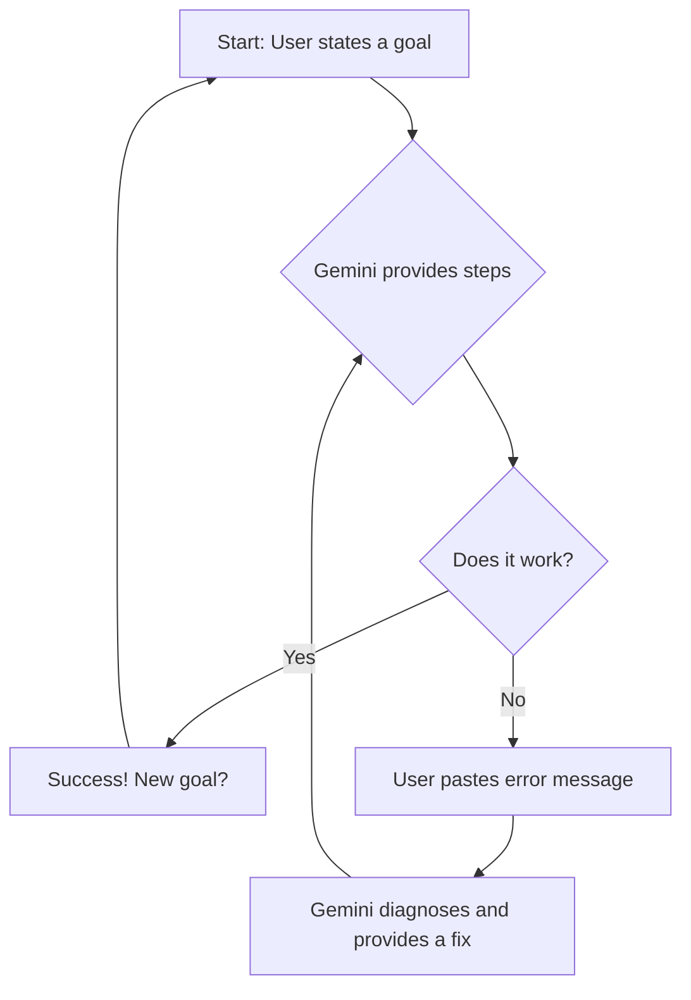

# Development Notes & Configurations

This repository serves as a personal collection of helpful configurations, setup guides, and notes for my development environment. It also serves as a home for feasibility studies and explorations conducted with the help of Gemini Code Assist.

---

## The Story of This Repository: A Neurodivergent Coder's Journey with AI

This repository is more than just a collection of configuration files; it's a living document of a learning journey. As a developer with dyslexia, dyscalculia, ADHD, and Autism, traditional coding tutorials and documentation can often present significant barriers. This project was built from the ground up in a collaborative process with Gemini Code Assist, demonstrating a new, more accessible path to learning and building.

### Our Collaborative Process

The goal was to create a modern, professional development environment from scratch. The method was a conversational, iterative workflow:

1.  **Stating the Goal:** I would describe what I wanted to achieve in plain language.
2.  **Getting the Steps:** Gemini provided the necessary commands and configurations.
3.  **Debugging Together:** When errors occurred—which they often do in development—I would paste the exact error message. Gemini would then diagnose the problem, explain *why* it happened, and provide the corrected command.

We worked through version-specific issues in the Jujutsu (`jj`) version control system, configured user identity, and navigated unfamiliar command-line editors. Each hurdle became a learning opportunity instead of a roadblock.

Here is a visual representation of our workflow:



### Why This Matters

For neurodivergent individuals, the ability to get immediate, non-judgmental feedback and have complex errors explained simply is transformative. An AI assistant can act as a patient, knowledgeable mentor that adapts to a user's learning style.

This repository stands as proof that with the right tools and a new approach to learning, anyone can build complex technical setups and learn to code effectively.

See the Full Development Environment Setup Guide for a comprehensive overview of the final, working configuration.

---
[asciiart](https://www.asciiart.eu/electronics/robots)
```ascii
                   _______
                 _/       \_
                / |       | \
               /  |__   __|  \
              |__/((o| |o))\__|
              |      | |      |
              |\     |_|     /|
              | \           / |
               \| /  ___  \ |/
                \ | / _ \ | /
                 \_________/
                  _|_____|_
             ____|_________|____
            /                   \  -- Mark Moir

> "I'm sorry, my responses are limited. You must ask the right questions."
>
> — VIKI, *iRobot*

---
*This repository and its documentation were set up with the assistance of Gemini Code Assist.*